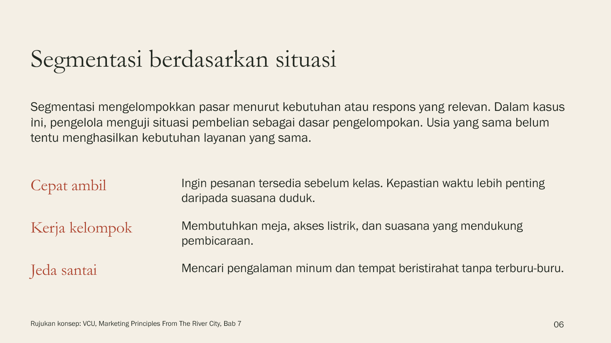
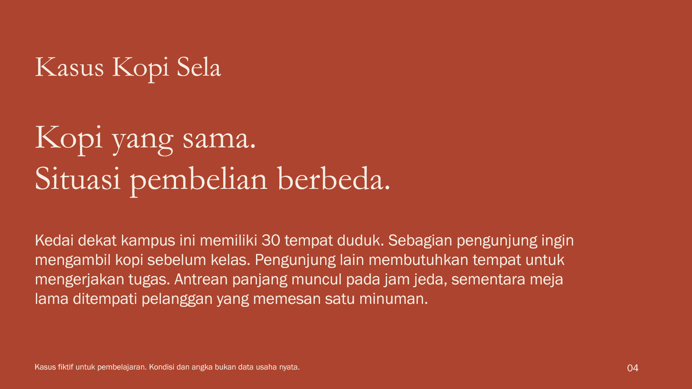
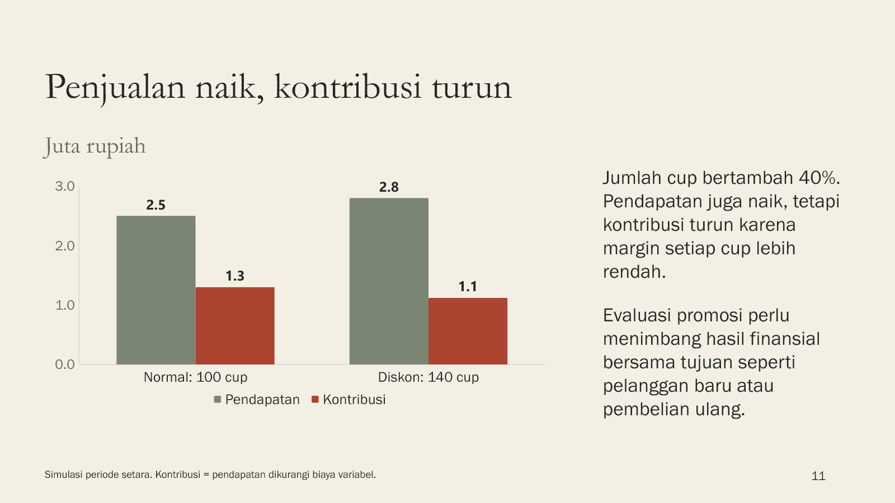

# SlideStudio

**Materi kuliah yang mengikuti kebutuhan dosen, dalam PowerPoint yang dapat diedit dan PDF.**

Kit terbuka berisi skill AI, template akademik, dan brief pembelajaran untuk membantu dosen menyusun penjelasan, contoh, latihan, serta catatan mengajar. Mulai dari tujuan pertemuan dan materi Anda, lalu sesuaikan kedalaman isi dan tampilan.

[Mulai menggunakan](docs/GETTING_STARTED.md) · [Contoh hasil](examples/README.md) · [Kebutuhan dosen](docs/LECTURER_GUIDE.md) · [Kontribusi](CONTRIBUTING.md)

## Contoh: Manajemen Pemasaran

Kuliah pengantar 16 slide dengan kasus kedai kopi fiktif. Materi mencakup STP, bauran pemasaran, simulasi diskon, pengalaman pelanggan, dan evaluasi. Judul memakai Garamond, teks Franklin Gothic Book, dengan latar hangat dan aksen merah bata.

| Studi kasus | Grafik dan pembahasan |
|---|---|
|  |  |

**[Unduh PowerPoint](examples/marketing/manajemen-pemasaran.pptx)** · [Brief contoh](examples/marketing/brief.md) · [Sumber dan asumsi](examples/marketing/SOURCES.md)

Teks dan grafik bisa diedit. Catatan dosen memuat penjelasan tambahan dan panduan diskusi. Kondisi dan angka Kopi Sela merupakan simulasi pembelajaran. Untuk mempertahankan tampilan saat mengedit, gunakan kedua font tersebut atau ganti secara konsisten dan periksa ulang. Font tidak disertakan dalam kit.

## Mulai menggunakan

1. **Siapkan materi.** Gunakan RPS, catatan kuliah, atau bacaan yang boleh dipakai.
2. **Jelaskan kebutuhan.** Isi [brief pertemuan](course/brief.md) atau sampaikan topik, mahasiswa sasaran, durasi, dan bentuk penjelasan dengan bahasa biasa.
3. **Buat dan tinjau.** Berikan skill dan sumber kepada agen AI yang dapat membuat file. Minta PPTX/PDF, kemudian periksa isi akademik dan tampilan.

> Buat presentasi berdasarkan materi dan kebutuhan saya. Ikuti lecture-slides beserta panduan penyamaan kebutuhannya. Jelaskan asumsi dan sesuaikan kedalaman dengan mahasiswa. Buat PPTX editable dengan contoh, sumber, latihan, serta catatan dosen. Periksa tampilan setiap slide sebelum menyerahkan hasil.

Pilih [panduan dosen](docs/GETTING_STARTED.md#untuk-dosen) atau [panduan agen proyek](docs/GETTING_STARTED.md#untuk-agen-proyek).

## Mengikuti kebutuhan dosen

- **Fungsi slide:** pendamping ceramah, belajar mandiri, atau gabungan.
- **Pengembangan isi:** setia pada sumber, pengembangan terbatas, atau pengembangan dengan riset.
- **Preferensi dosen:** profil opsional dengan cakupan dan status yang bisa dikoreksi.
- **Penyamaan tampilan:** tiga contoh slide opsional sebelum membuat seluruh deck.
- **Pemeriksaan pembelajaran:** tujuan, penjelasan, contoh, dan penilaian terhubung dalam peta cakupan.

Detail ada di [panduan kebutuhan](docs/LECTURER_GUIDE.md). Preferensi satu presentasi tidak otomatis menjadi aturan permanen.

## Template dan contoh

| Pilihan | Karakter | Unduh |
|---|---|---|
| Academic Paper | Judul serif, latar hangat, aksen hijau | [PPTX](templates/academic-paper.pptx) |
| Academic Ink | Tipografi sans, latar putih, aksen biru | [PPTX](templates/academic-ink.pptx) |
| Manajemen Pemasaran | Contoh lengkap dengan komposisi editorial | [PPTX](examples/marketing/manajemen-pemasaran.pptx) |
| Mean dan median | Konsep, perhitungan, dan grafik | [PPTX](examples/mean-median.pptx) / [PDF](examples/mean-median.pdf) |

Kedua template berisi tujuh layout 16:9 yang dapat diduplikasi. Template institusi mengambil prioritas bila diwajibkan. Marketing menunjukkan satu pilihan desain, bukan gaya wajib setiap mata kuliah.

## Kemampuan dan persyaratan

Kit ini menyediakan instruksi dan aset, tanpa layanan AI atau aplikasi web bawaan. Agen harus memiliki kemampuan membuat file presentasi. Mengunggah skill saja tidak menambahkan kemampuan tersebut. Ekspor PDF dan pemeriksaan render bergantung pada alat yang tersedia.

Dosen tetap meninjau ketepatan akademik. Pemeriksa otomatis hanya memeriksa struktur PPTX, bukan kualitas desain atau kebenaran materi. [Detail ekspor dan pemeriksaan](docs/TOOLS.md).

## Dokumentasi

- [Mulai menggunakan](docs/GETTING_STARTED.md)
- [Kebutuhan dan preferensi dosen](docs/LECTURER_GUIDE.md)
- [Prinsip desain](docs/DESIGN.md) dan [contoh prompt](docs/PROMPTS.md)
- [Ekspor PDF dan pemeriksaan](docs/TOOLS.md)
- [Galeri dan contoh materi](examples/README.md)
- [Publikasi repositori](docs/PUBLISHING.md)
- [Riwayat perubahan](CHANGELOG.md)

## Kontribusi dan lisensi

Kontribusi dapat berupa template, contoh kuliah, perbaikan instruksi, atau laporan masalah. Baca [CONTRIBUTING.md](CONTRIBUTING.md) sebelum mengirim perubahan. Formulir masalah memisahkan tampilan, isi, dan kompatibilitas file.

[MIT](LICENSE) berlaku untuk instruksi, dokumentasi, template, contoh orisinal, dan scripts kit ini. Sumber eksternal mengikuti lisensi pemiliknya. Font, logo institusi, dan materi tambahan tidak otomatis tercakup.
