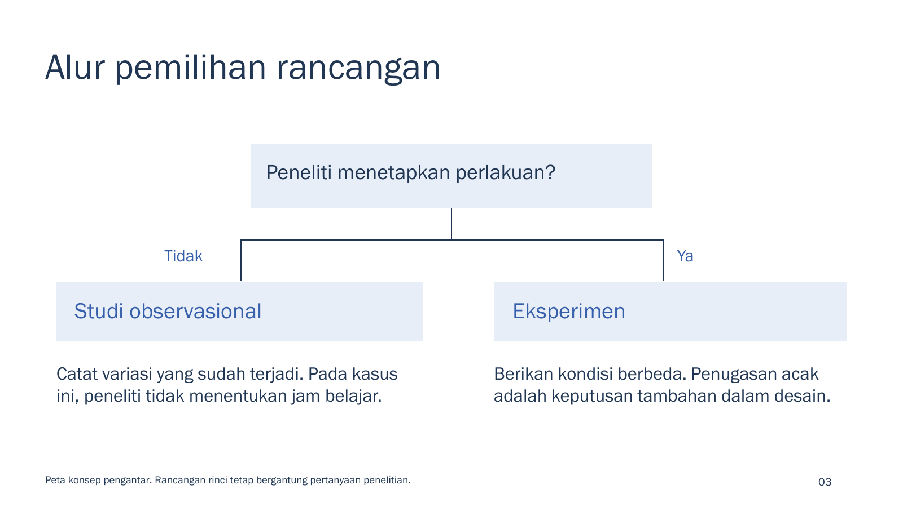

# Rancangan penelitian sederhana

[PowerPoint editable, 8 slide](methods.pptx) · [PDF 8 halaman](methods.pdf) · [Brief](brief.md) · [Sumber](SOURCES.md) · [Contoh revisi](REVISIONS.md) · [Peta cakupan](coverage-map.md)

Contoh pertemuan singkat, bukan materi satu semester. Institusional: Franklin Gothic Book, putih dan biru. Teks dan diagram dapat diedit; jawaban dan panduan mengajar ada dalam speaker notes. Font tidak disertakan. PDF diekspor langsung dari PPTX final memakai PowerPoint, tanpa notes dosen. Ekspor ulang bila isi PPTX berubah.
