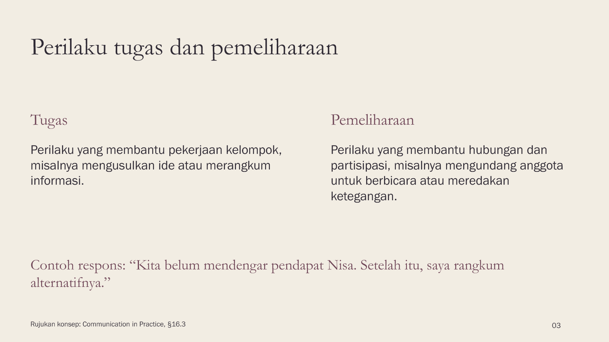

# Norma dan peran kelompok

[PowerPoint editable, 8 slide](social.pptx) · [Brief](brief.md) · [Sumber](SOURCES.md) · [Contoh revisi](REVISIONS.md) · [Peta cakupan](coverage-map.md)

Contoh pertemuan singkat, bukan materi satu semester. Editorial: Garamond dan Franklin Gothic Book. Teks dan diagram dapat diedit; jawaban dan panduan mengajar ada dalam speaker notes. Font tidak disertakan. PDF belum disertakan; ekspor PPTX yang telah diperiksa pada aplikasi Anda.
